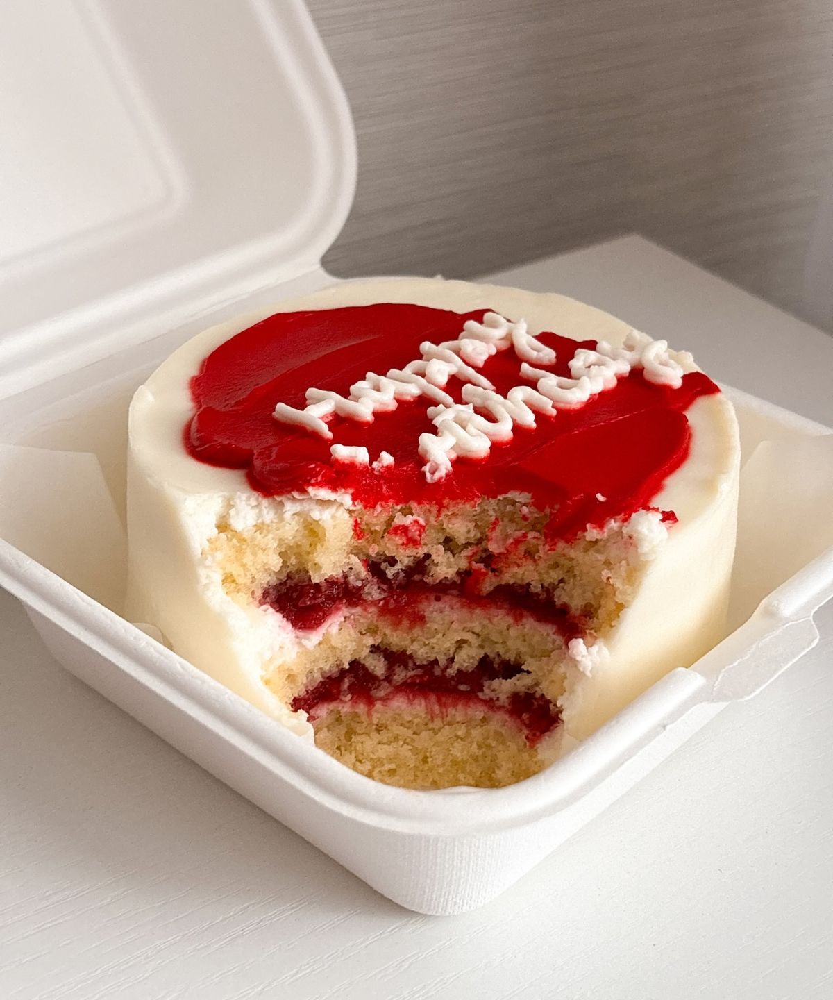

# Maison Steff - Presentación web

Presentación escolar interactiva y completamente local para la microempresa **Maison Steff**. Fue creada con HTML5, CSS3 y JavaScript puro; no necesita internet, instalaciones, frameworks ni librerías externas.

## Enlaces del proyecto

- Repositorio: `https://github.com/Marvin-404/maison-steff`
- GitHub Pages: `https://marvin-404.github.io/maison-steff/`
- Instagram: `https://www.instagram.com/maison_steff/`

## Cómo abrir el proyecto

1. Abre la carpeta `maison-steff-presentacion-web` (o esta carpeta del proyecto).
2. Haz doble clic en `index.html`.
3. El sitio se abrirá en el navegador predeterminado y funcionará sin conexión.

Para exponer en pantalla completa, presiona `F11` en la mayoría de navegadores.

## Controles de presentación

- Usa el menú superior para ir directamente a una sección.
- Usa los botones flotantes de la esquina inferior derecha para avanzar, retroceder o volver al inicio.
- `Flecha derecha` o `Page Down`: siguiente sección.
- `Flecha izquierda` o `Page Up`: sección anterior.
- `Home`: volver al inicio.
- `End`: ir al cierre.

## Estructura del proyecto

```text
maison-steff-presentacion-web/
  index.html
  css/
    style.css
  js/
    main.js
  assets/
    maison-steff-logo.png
    pastel-fresa.jpg
    pastel-vainilla.jpg
    pastel-chocolate.jpg
    pastel-tres-leches.jpg
    empaque-pasteles.jpg
    qr_instagram_maison_steff.png
    qr_sitio_web_maison_steff.png
  README.md
```

## Dónde cambiar textos

Todos los textos de la presentación están en `index.html`. Busca el título o frase que deseas modificar y reemplaza su contenido entre las etiquetas HTML.

Las ocho secciones principales son:

1. Inicio
2. Marca
3. Producto
4. Mercado
5. Marketing
6. Empresa
7. Investigación y contacto
8. Cierre

## Dónde colocar imágenes

Guarda las imágenes nuevas dentro de la carpeta `assets/`. Usa nombres simples, por ejemplo:

```text
assets/pastel-fresa.jpg
assets/pastel-vainilla.jpg
```

Después puedes insertarlas en `index.html` con:

```html

```

## Cómo cambiar fotos de productos

Las cuatro tarjetas de sabores usan fotografías locales guardadas en `assets/`.

Para cambiar una fotografía:

1. Abre `index.html`.
2. Busca la tarjeta del sabor, por ejemplo `class="flavor-card strawberry"`.
3. Cambia la ruta `src` y el texto alternativo `alt`:

```html
<div class="product-photo-wrap">
  
</div>
```

La clase `.product-photo` ya controla el recorte, tamaño, bordes y efecto hover.

## Personalización visual

Los colores principales se encuentran al inicio de `css/style.css`, dentro de `:root`. Cambia esos valores para actualizar la paleta en todo el sitio.

El logotipo oficial utilizado por la web está en `assets/maison-steff-logo.png`. El archivo original `assets/Maison Steff.png` se conserva sin modificaciones.

## Instagram y QR

La tarjeta de Instagram enlaza al perfil oficial:

`https://www.instagram.com/maison_steff/`

La sección **Investigación y contacto** muestra dos códigos QR locales:

- `assets/qr_instagram_maison_steff.png`: abre el Instagram oficial.
- `assets/qr_sitio_web_maison_steff.png`: abre la presentación publicada en GitHub Pages.

Para reemplazar un QR, conserva el mismo nombre de archivo o actualiza su ruta en `index.html`.

## Publicación en GitHub Pages

El proyecto está preparado para publicarse como sitio estático desde la rama `main`:

1. Abre la configuración del repositorio.
2. Entra en **Pages**.
3. Selecciona **Deploy from a branch**.
4. Elige la rama `main` y la carpeta `/ (root)`.
5. Guarda la configuración.

Los documentos administrativos y assets fuente no utilizados permanecen en la computadora, pero están excluidos mediante `.gitignore` para evitar publicarlos accidentalmente.

## Funcionamiento sin internet

El proyecto no usa Google Fonts, CDN, Bootstrap, Tailwind, React ni recursos externos para mostrarse. Todo lo visual se encuentra dentro de la carpeta; únicamente el botón de Instagram requiere internet cuando se desea abrir el perfil.
